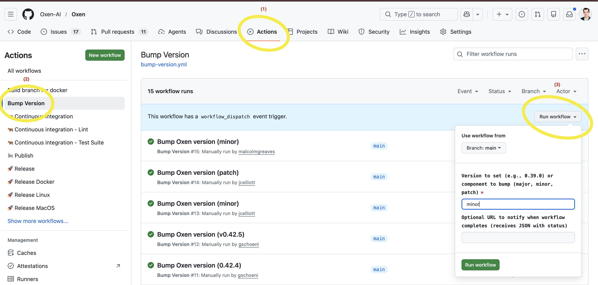

# Release Runbook

This document describes the steps to promote a commit on `main` to a new versioned release of Oxen.

For a tl;dr, see the [Summary](#summary).

## Prerequisites

- You must have permission to trigger GitHub Actions workflows on this repository.
- You must have permission to edit GitHub Releases on this repository.
- The commit you want to release must already be on `main`.

## Step 1: Bump the Version

Go to the **Actions** tab in GitHub and select the **Bump Version** workflow ([`bump-version.yml`](.github/workflows/bump-version.yml)).

Click **Run workflow** and fill in the `version` input with one of:
- An explicit version number, e.g. `0.44.0`
- A semver component to auto-increment: `major`, `minor`, or `patch`



This workflow runs `scripts/bump-version.sh`, which updates the version string in all of the following files:
- `package.version` in `Cargo.toml` files ([`oxen-rust/Cargo.toml`](oxen-rust/Cargo.toml), [`oxen-python/Cargo.toml`](oxen-python/Cargo.toml))
- `project.version` in [`oxen-python/pyproject.toml`](oxen-python/pyproject.toml)
- The `version` in lockfiles ([`oxen-rust/Cargo.lock`](oxen-rust/Cargo.lock), [`oxen-python/Cargo.lock`](oxen-python/Cargo.lock), [`oxen-python/uv.lock`](oxen-python/uv.lock))

It then creates a commit on `main` with the message `Bump v{VERSION}`, tags it `v{VERSION}`, and pushes both the commit and the tag.

## Step 2: Wait for All Builds to Complete

Pushing the `v*` tag automatically triggers the **Release** workflow ([`release.yml`](.github/workflows/release.yml)). This fans out into parallel builds across all supported platforms:

- **Linux arm64 and x86_64** ([`release_linux.yml`](.github/workflows/release_linux.yml)) — EC2 runners
- **macOS arm64 and x86_64** ([`release_macos.yml`](.github/workflows/release_macos.yml)) — GitHub-hosted runner, cross-compiled
- **Windows x86_64** ([`release_windows.yml`](.github/workflows/release_windows.yml)) — EC2 runner
- **Docker arm64 and x86_64** ([`release_docker.yml`](.github/workflows/release_docker.yml)) — EC2 runners

Python wheels for versions 3.10, 3.11, 3.12, and 3.13 are built as part of each platform job.

When all builds finish, the workflow creates a **draft** GitHub Release named `Release {VERSION}` with all artifacts attached.

Monitor the workflow run in the **Actions** tab. If any platform build fails, the draft release is still created with whatever artifacts succeeded (due to the `if: success() || failure()` condition on the draft step). You should investigate and resolve any failures before publishing.

### Artifacts Produced

| Platform | Artifacts |
|---|---|
| Linux arm64 | `oxen-linux-arm64.tar.gz`, `oxen-server-linux-arm64.tar.gz`, `oxen-linux-arm64.deb`, `oxen-server-linux-arm64.deb`, `oxen-wheels-linux-arm64.tar.gz` |
| Linux x86_64 | `oxen-linux-x86_64.tar.gz`, `oxen-server-linux-x86_64.tar.gz`, `oxen-linux-x86_64.deb`, `oxen-server-linux-x86_64.deb`, `oxen-wheels-linux-x86_64.tar.gz` |
| macOS arm64 | `oxen-macos-arm64.tar.gz`, `oxen-server-macos-arm64.tar.gz`, `oxen-wheels-macos-arm64.tar.gz` |
| macOS x86_64 | `oxen-macos-x86_64.tar.gz`, `oxen-server-macos-x86_64.tar.gz`, `oxen-wheels-macos-x86_64.tar.gz` |
| Windows x86_64 | `oxen-windows-x86_64.exe.zip`, `oxen-server-windows-x86_64.exe.zip`, `oxen-wheels-windows-x86_64.zip` |
| Docker arm64 | `oxen-server-docker-arm64.tar` |
| Docker x86_64 | `oxen-server-docker-x86_64.tar` |

## Step 3: Write Release Notes and Publish

Go to the **Releases** page on GitHub. You will see the draft release created by the workflow.

Click **Edit** on the draft.

**You must write good release notes before publishing.** The auto-generated body only contains platform compatibility tables. Replace or supplement it with a summary of what changed in this release. **At minimum, include**:

- New features
- Bug fixes
- Breaking changes or migration steps
- Notable dependency updates

Review the commit log between the previous release tag and this one to ensure nothing is missed:

```bash
git log v{PREVIOUS_VERSION}..v{VERSION} --oneline
```

Once the release notes are complete, click **Publish release**.

## Step 4: Verify Publishing

Publishing the release automatically triggers the **Publish** workflow ([`publish.yml`](.github/workflows/publish.yml)), which:

1. **Publishes Python wheels to PyPI** — downloads the `oxen-wheels-*` artifacts from the release and uploads all `.whl` files via maturin (_secret: `PYPI_API_TOKEN`_).
2. **Publishes the `liboxen` crate to crates.io** — runs `cargo publish` from [`oxen-rust/src/lib`](`oxen-rust/src/lib) (_secret: `CRATES_IO_TOKEN`_).
3. **Updates the `oxen` Homebrew formula** — opens a PR against [`Homebrew/homebrew-core`](https://github.com/Homebrew/homebrew-core) to update [`Formula/o/oxen.rb`](https://github.com/Homebrew/homebrew-core/blob/main/Formula/o/oxen.rb) (_secret: `GH_PERSONAL_ACCESS_TOKEN`_).
4. **Updates the `oxen-server` Homebrew formula** — pushes directly to [`Oxen-AI/homebrew-oxen-server`](https://github.com/Oxen-AI/homebrew-oxen-server) on `main`, updating [`Formula/oxen-server.rb`](https://github.com/Oxen-AI/homebrew-oxen-server/blob/main/Formula/oxen-server.rb) (_secret: `GH_PERSONAL_ACCESS_TOKEN`_).

Monitor the **Publish** workflow in the **Actions** tab and verify:

- [ ] ✅ The `oxenai` package appears on PyPI at the new version.
- [ ] ✅ The `liboxen` crate appears on crates.io at the new version.
- [ ] ✅ A PR has been opened (or merged) on `Homebrew/homebrew-core` for the `oxen` formula.
- [ ] ✅ The `oxen-server` formula in `Oxen-AI/homebrew-oxen-server` has been updated.

## Summary

| Step | Action | Trigger |
|------|--------|---------|
| 1 | Run **Bump Version** GitHub workflow with desired version. | Manual (workflow dispatch) |
| 2 | Wait for **Release** workflow to build all artifacts and create a draft release. | Automatic (on tag push) |
| 3 | Edit draft release, write release notes, click **Publish**. | Manual |
| 4 | Verify **Publish** workflow succeeds (PyPI, crates.io, Homebrew). | Automatic (on release published) |
